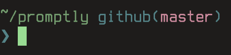
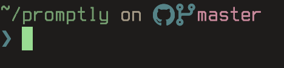
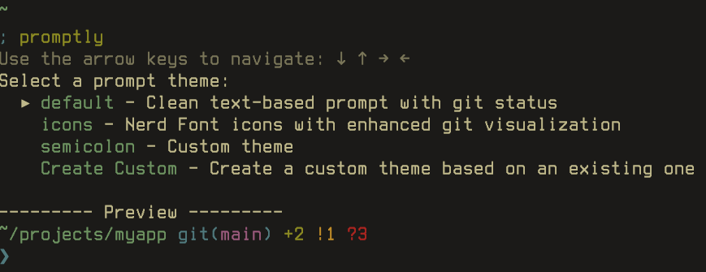

# Promptly

A fast, minimalist Zsh prompt with an interactive installer. Choose your style, install instantly.

## Features

**Interactive installer** - Preview themes before installing  
**Custom theme creation** - Create and manage your own themes  
**High performance** - Optimized Git status parsing  
**Multiple themes** - Text-based and icon variants  
**Zero configuration** - Auto-installs and configures  
**Cross-platform** - Works on Linux, macOS, and Windows  

## Themes

### Default - Clean Text


Clean, readable prompt with Git status indicators using text symbols.

### Icons - Nerd Font Enhanced  


Beautiful icons with enhanced Git visualization (requires Nerd Font).

### Custom Themes

Create your own themes based on existing templates. Choose "Create Custom" in the installer to:
- Build custom themes from default or icons base
- Store themes in `~/.config/promptly/` 
- Automatically load custom themes alongside built-in options

## Quick Install

```bash
curl -sSL https://raw.githubusercontent.com/owlfacegames/promptly/master/install.sh | bash
```

Then run:
```bash
promptly
```



Use arrow keys to preview themes, select "Create Custom" to make your own, press Enter to install. Restart your terminal to see changes.

## What it does

1. Shows interactive theme selector with live previews
2. Installs chosen theme to `~/.promptly.zsh`  
3. Adds `source ~/.promptly.zsh` to your `.zshrc`
4. Ready to use immediately

## Requirements

- **Zsh shell**
- **curl** (for installer)
- **Nerd Font** (for icons theme) - [Install here](https://www.nerdfonts.com/)

## Uninstall

Remove from `.zshrc`:
```bash
# Delete this line from ~/.zshrc
source ~/.promptly.zsh
```
